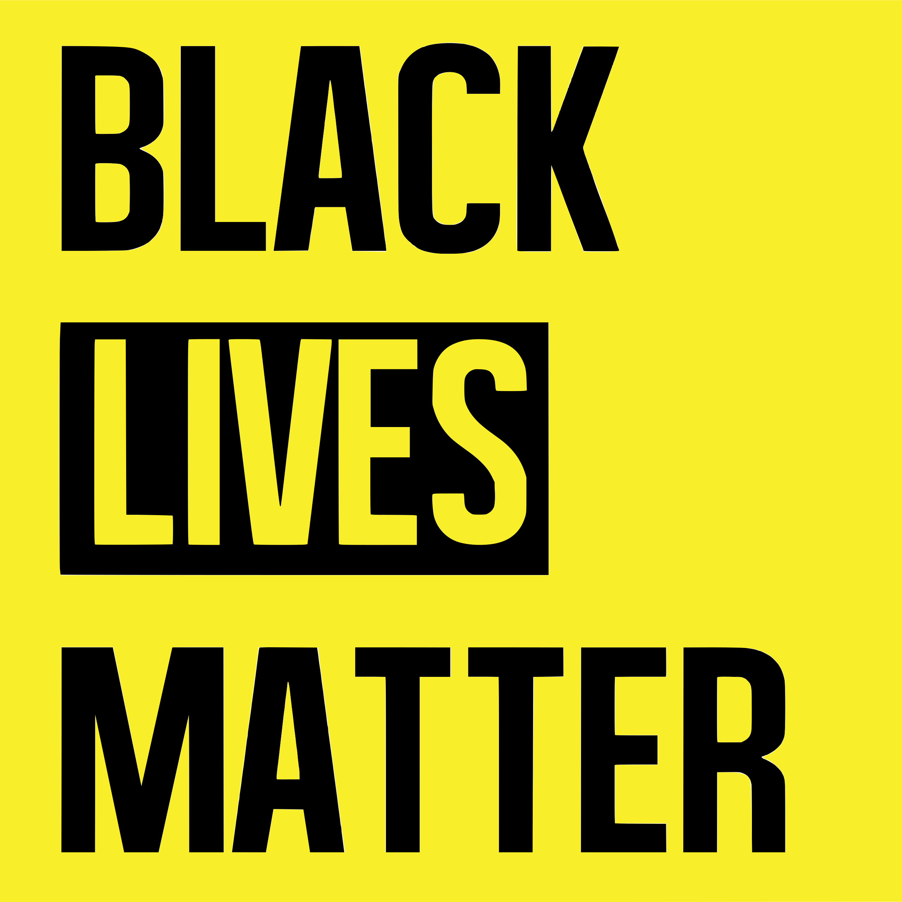

We, Begin, stand in solidarity with the Black community, and oppose the systems of injustice, inequality, and white supremacy that have oppressed American communities of color for hundreds of years.

Although it is only a minor gesture, we have replaced our regular home page with [this site](index.html) in the hopes of inspiring more people in America and around the world to speak out against the immoral and abhorrent behaviors we continue to witness perpetrated on our fellow citizens.

### How to use the site

Use the [index.html](index.html) file in this repository as necessary for your site or application; placeholders are denoted with `$REPLACE`.

### License and usage

This site is licensed Apache 2.0; no credit is necessary, please modify and use it as you see fit; we kindly ask that you do not willfully distort the core message in service of unrelated things, or attempt to profit from its use (example: by adding affiliate links).
